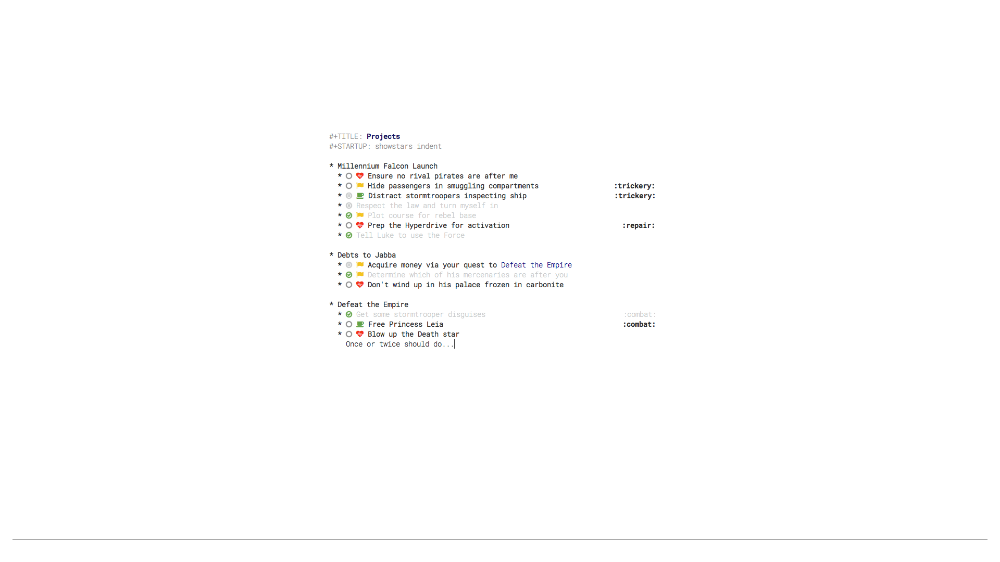

# Elegant Emacs: Expanded

The lovely [elegant emacs](https://github.com/rougier/elegant-emacs/) but with my own opinionated additions to it.

## To-do
Currently on the chopping block:

- Figuring out how to integrate some of [Rougier](https://github.com/rougier)'s other Emacs hacks.
- Notetaking work.
- More config centered around coding 

## Screenshots
A simple org mode buffer:

